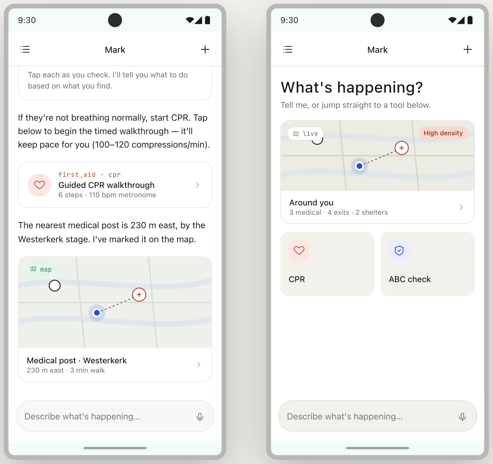
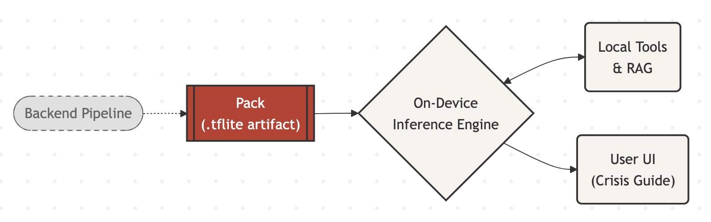

# Mark On-Device Emergency Copilot


When people need help fast, the app keeps things simple: ask a question, get practical guidance, and instantly see nearby critical points on the map — all while staying fully usable offline.
A minimal **Expo + React Native (Android)** chatbot that runs a quantized **Gemma 4 E2B-it** fully on-device via Google's official [LiteRT-LM](https://ai.google.dev/edge/litert/lm/android) Kotlin API (`com.google.ai.edge.litertlm:litertlm-android`).

No API calls. No keys. The `.litertlm` model file is automatically downloaded to the device on first launch (no manual setup) and inference runs in-process.

---
## Installation

[Download Link](https://drive.google.com/file/d/1sFg1heSZwPxKzWE0QGI-ZeXEyQhy5-Hz/view) Android Only.

## The App Experience

The main screen combines a crisis-focused chat assistant and a live map with nearby emergency points of interest.



---

## Frontend Architecture



The mobile app is the runtime layer: it loads local Packs, runs retrieval and inference on-device, and presents the results through a fast chat + map interface.

---

## What the Frontend Does

- Chat interface with streaming responses from a local Gemma model.
- Retrieval-augmented answers from bundled Pack data (`core_medical`, local POIs, event-specific packs).
- Interactive map with emergency POIs (hospital, AED, pharmacy, shelter, police, and more).
- Tool-driven actions via app-side agents for CPR flow, GPS context, and medical retrieval.
- Offline-first behavior after assets are installed on device.

## Tech Stack

- Kotlin + Jetpack Compose
- Android SDK (`minSdk 26`, `targetSdk 36`)
- Google LiteRT-LM (`com.google.ai.edge.litertlm:litertlm-android`)
- Kotlin Coroutines + ViewModel
- MapLibre Android SDK

## Project Structure

```text
app/
  src/main/java/com/example/emergency/
    agent/      # Tool interfaces + tool manager + tools
    llm/        # Gemma runtime wrapper
    ui/         # Navigation, screens, state, theme
    MainActivity.kt
  src/main/assets/
    core_medical.json
    pois-nl.geojson
```

## Run Locally (Android)

### Prerequisites

- Android Studio (latest stable)
- JDK 11+
- Android SDK + emulator/device

### Build & Run

```bash
./gradlew :app:assembleDebug
./gradlew :app:installDebug
```

Or open the project in Android Studio and run the `app` configuration.

## Backend Pipeline

The build-time Packs pipeline (training, quantization, packaging) is documented in [`README_backend.md`](README_backend.md).
